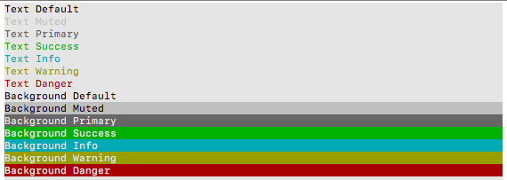

# Colorify [ for Win & Mac ]


**Colorify** was created to simplify and automate tasks related to NET Core console formating. Was born in 
[HardHat](https://github.com/equiman/hardhat/) project as a Class. Now grow up as library and can be used other console applications.

Contributions or Beer :beers: will be appreciated :thumbsup:

> The Code is Dark and Full of Errors!  
> Console is your friend ... don't be afraid!

## Menu

* [Getting Started](#getting-started)
  * [Prerequisites](#prerequisites)
  * [Installing](#installing)
  * [Add Reference](#add-reference)
  * [Instantiate Library](#instantiate-library)
* [Usage](#usage)
  * [Colors](#colors)
  * [Write](#write)
  * [WriteLine](#writeline)
  * [Align](#align)
  * [Blank Lines](#blank-lines)
  * [Division Lines](#division-lines)
* [About](#about)
  * [Built With](#built-with)
  * [Contributing](#contributing)
  * [Versioning](#versioning)
  * [Authors](#authors)
  * [License](#license)
  * [Acknowledgments](#acknowledgments)

---

## Getting Started

These instructions will get you a copy of the project up and running on your local machine for development and testing purposes.

### Prerequisites

What things you need to install?

* [NET Core SDK](https://www.microsoft.com/net/download)
* [ToolBox](https://github.com/equiman/hardhat/)

### Installing

Follow this steps to install on your local machine

Clone **Colorify** from GitHub on *recommended* path. Using this command on terminal:

| OS | Command |
| --- | --- |
| win | `git clone https://github.com/equiman/colorify.git "D:\Developer\DEIN\Projects\_devCC"` |
| mac | `git clone https://github.com/equiman/colorify.git ~/Developer/DEIN/Projects/_devCC` |

## Add Reference

In your project folder, where is located .csproj file run this command on terminal:

| OS | Command |
| --- | --- |
| win | `dotnet add reference "D:\Developer\DEIN\Projects\_devCC\Colorify\Colorify.csproj"` |
| mac | `dotnet add reference ~/Developer/DEIN/Projects/_devCC/Colorify/Colorify.csproj` |

Or take a look of official documentation: [dotnet-add reference](https://docs.microsoft.com/en-us/dotnet/core/tools/dotnet-add-reference)

Keep calm, you are almost done. Review this final steps and enjoy the life, no more tedious and repetitive tasks stealing your precious time.

### Instantiate Library

On the main class Program, add an static property Format and inside Main method create an instance of the  library according the Operative System.

```csharp
class Program
{
  private static Format _format {get; set;}

  static void Main(string[] args)
  {
      switch (OS.GetCurrent())
      {
          case "win":
              _format = new Format(Theme.Win);
              break;
          case "mac":
              _format = new Format(Theme.Mac);
              break;
      }
      //Foo()
      //Bar()
      _format.ResetColor();
  }
}
```

This command `_format.ResetColor();` is important in order to reset default terminal colors when programs finish.

## Usage

I'll try explain the usage, but I think the best way is take a look in [Sample](https://github.com/equiman/colorify/tree/master/Sample) folder, better easy to use guide that words.

### Colors

**Colorify** colors was created inspired on [Bootstrap colors](https://getbootstrap.com/docs/4.0/utilities/colors/) a list whit a meaning easy to remember.

```csharp
_format.WriteLine("Text Default", Colors.txtDefault);
_format.WriteLine("Text Muted", Colors.txtMuted);
_format.WriteLine("Text Primary", Colors.txtPrimary);
_format.WriteLine("Text Success", Colors.txtSuccess);
_format.WriteLine("Text Info", Colors.txtInfo);
_format.WriteLine("Text Warning", Colors.txtWarning);
_format.WriteLine("Text Danger", Colors.txtDanger);
_format.WriteLine("Background Default", Colors.bgDefault);
_format.WriteLine("Background Muted", Colors.bgMuted);
_format.WriteLine("Background Primary", Colors.bgPrimary);
_format.WriteLine("Background Success", Colors.bgSuccess);
_format.WriteLine("Background Info", Colors.bgInfo);
_format.WriteLine("Background Warning", Colors.bgWarning);
_format.WriteLine("Background Danger", Colors.bgDanger);
```



Colors are defined on `Theme` folder. There is two themes for MacOs and Windows. You can edit the `ThemeMac.cs` (Light) or `ThemeWin.cs` (Dark) files or create a new one implementing the `ITheme` interface.

### Write

`_format.Write` work like `Console.Write` but wrapped with colors. If you don't specify a color will use the `Colors.txtDefault` by default.

```csharp
_format.Write("Text");
```

```csharp
_format.Write("Text", Colors.bgDefault);
```

You can stack a multiple `_format.Write`, just remember define the last one as WriteLine.

```csharp
_format.Write(" Default ", Colors.bgDefault);
_format.Write(" Muted   ", Colors.bgMuted);
_format.Write(" Primary ", Colors.bgPrimary);
_format.Write(" Success ", Colors.bgSuccess);
_format.Write(" Info    ", Colors.bgInfo);
_format.Write(" Warning ", Colors.bgWarning);
_format.WriteLine(" Danger  ", Colors.bgDanger);
```


### WriteLine

`_format.WriteLine` work like `Console.WriteLine` with a line terminator after the text but wrapped with colors. If you don't specify a color will use the `Colors.txtDefault` by default.

```csharp
_format.WriteLine("Text with line terminator");
```

```csharp
_format.WriteLine("Text with line terminator", Colors.bgDefault);
```

Automatic line wrap with long text:

```csharp
_format.Write("Short Text at First Preceded with a ", Colorify.Colors.bgInfo);
_format.WriteLine(" Long Multilinetext with Line Wrap that bring a new line", Colorify.Colors.bgSuccess);
```


### Align

All the align methods (Center/Left/Right) works like `Console.WriteLine` but with align operation and wrapped with colors. If you don't specify a color will use the `Colors.txtDefault` by default.

```csharp
_format.AlignCenter("Text Aligned to Center");
_format.AlignRight("Text Aligned to Right");
_format.AlignLeft("Text Aligned to Left");
```

```csharp
_format.AlignCenter("Text Aligned to Center", Colorify.Colors.bgInfo);
_format.AlignRight("Text Aligned to Right", Colorify.Colors.txtDefault);
_format.AlignLeft("Text Aligned to Left", Colorify.Colors.txtDanger);
```

`AlignSplit` is the way to show two values on the same line. Text will be split with pipe `|` character, the first element will be aligned to left and second aligned to right.

```csharp
_format.AlignSplit("<-Text to Left| Text to Right->");
```

```csharp
_format.AlignSplit("<-Text to Left| Text to Right->", Colorify.Colors.bgSuccess);
```


### Blank Lines

`_format.BlankLines` works like `Console.WriteLine` but without text. You can combine the amount of lines and color. Default values will be `1` line and `Colors.txtDefault`.

```csharp
_format.BlankLines();
_format.BlankLines(Colorify.Colors.bgDanger);
```


```csharp
_format.BlankLines(3);
_format.BlankLines(3, Colorify.Colors.bgSuccess);
```


### Division Lines

`_format.DivisionLines` works like `Console.WriteLine` but without the same character as full width text. . If you don't specify a color will use the `Colors.txtDefault` by default.

```csharp
_format.RepeatLine('-', Colorify.Colors.bgDefault);
_format.RepeatLine('+', Colorify.Colors.bgMuted);
_format.RepeatLine('~', Colorify.Colors.bgPrimary);
_format.RepeatLine('=', Colorify.Colors.bgSuccess);
_format.RepeatLine('-', Colorify.Colors.bgInfo);
_format.RepeatLine('*', Colorify.Colors.bgWarning);
_format.RepeatLine('.', Colorify.Colors.bgDanger);
```


⇧ [Back to menu](#menu)

---

## About

### Built With

* [VS Code](https://code.visualstudio.com/) - Code editing redefined.

### Contributing

Please read [CONTRIBUTING](CONTRIBUTING.md) for details on our code of conduct, and the process for submitting pull requests to us.

### Versioning

We use [SemVer](http://semver.org/) for versioning. For the versions available, see the [HardHat](https://github.com/equiman/colorify/tags) on GitHub.

### Authors

* **Camilo Martinez** [[Equiman](http://stackoverflow.com/story/equiman)]

See also the list of [contributors](https://github.com/equiman/hardhat/contributors) who participated in this project.

### License

This project is licensed under the GNU GPLv3 License - see the [LICENSE](LICENSE) file for details.

### Acknowledgments

* [StackOverflow](http://stackoverflow.com): The largest online community for programmers.
* [Dot Net Perls](https://www.dotnetperls.com/console-color): C# Console Color, Text and BackgroundColor

⇧ [Back to menu](#menu)
