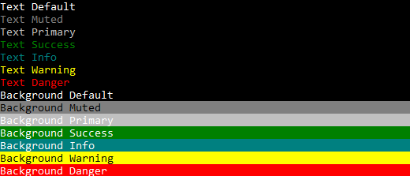

# dein Colorify [ Win+Mac+Linux ]

[](https://github.com/deinsoftware/colorify/actions?query=workflow%3Abuild)
[](https://github.com/deinsoftware/colorify/actions?query=workflow%3Apack)
[](https://www.nuget.org/packages/dein.Colorify/)
[](https://www.nuget.org/packages/dein.Colorify/)
[](https://sonarcloud.io/dashboard?id=dein%3Acolorify)
[](https://sonarcloud.io/dashboard?id=dein%3Acolorify)
[](https://sonarcloud.io/dashboard?id=dein%3Acolorify)
[](LICENSE.md)


**Colorify** was created to simplify and automate tasks related to .Net console formatting. Was born in [HardHat](https://github.com/deinsoftware/hardhat/) project as a Class. Now grown up as a library and can be used by other console applications.

> The Code is Dark and Full of Errors!
> Console is your friend ... don't be afraid!

## Menu

- [Getting Started](#getting-started)
  - [Prerequisites](#prerequisites)
    - [Recommended Dependencies](#recommended-dependencies)
    - [Add As Package](#add-as-package)
    - [Add As Reference](#add-as-reference)
  - [Instantiate Library](#instantiate-library)
- [Usage](#usage)
  - [Colors](#colors)
  - [Write](#write)
  - [WriteLine](#writeline)
  - [WordWrap](#wordwrap)
  - [Align](#align)
  - [BlankLines](#blanklines)
  - [DivisionLine](#divisionline)
- [About](#about)
  - [Built With](#built-with)
  - [Contributing](#contributing)
  - [Versioning](#versioning)
  - [Authors](#authors)
  - [Sponsors](#sponsors)
  - [License](#license)
  - [Acknowledgments](#acknowledgments)

---

## Getting Started

These instructions will get you a copy of the project up and running on your local machine for development and testing purposes.

### Prerequisites

What things you need to install?

- [.Net SDK](https://www.microsoft.com/net/download)

**Colorify** supports `netcoreapp3.1` and `net5.0` target frameworks.

### Installing

**Colorify** is available as [project](https://github.com/deinsoftware/colorify/) or [package](https://www.nuget.org/packages/dein.Colorify). We strong recommend add as a NuGet package if don't need make modifications directly on the source code library.

Follow these instructions to add **Colorify** in your project.

#### Recommended Dependencies

- [Newtonsoft.Json](https://www.nuget.org/packages/Newtonsoft.Json) Library
- [dein.ToolBox](https://www.nuget.org/packages/dein.ToolBox) Library

#### Add As Package

In your project folder, where is located .csproj file run this command on terminal:

```terminal
dotnet add package dein.Colorify
```

If you want to use OS class highly recommend use [ToolBox](https://github.com/deinsoftware/toolbox/) project.

```terminal
dotnet add package dein.ToolBox
dotnet add package Newtonsoft.Json
```

Official documentation: [dotnet add package](https://docs.microsoft.com/en-us/dotnet/core/tools/dotnet-add-package)

#### Add As Reference

Clone **Colorify** from GitHub on _recommended_ path. Using this command on terminal:

| OS  | Command                                                                                      |
| --- | -------------------------------------------------------------------------------------------- |
| win | `git clone https://github.com/deinsoftware/colorify.git "D:\Developer\DEIN\Projects\_devCC"` |
| mac | `git clone https://github.com/deinsoftware/colorify.git ~/Developer/DEIN/Projects/_devCC`    |

In your project folder, where is located .csproj file run this command on terminal:

| OS  | Command                                                                             |
| --- | ----------------------------------------------------------------------------------- |
| win | `dotnet add reference "D:\Developer\DEIN\Projects\_devCC\Colorify\Colorify.csproj"` |
| mac | `dotnet add reference ~/Developer/DEIN/Projects/_devCC/Colorify/Colorify.csproj`    |

Official documentation: [dotnet add reference](https://docs.microsoft.com/en-us/dotnet/core/tools/dotnet-add-reference)

### Instantiate Library

On the main class Program, add a static property Format and inside the Main method create an instance of the library according the Operative System.

```csharp
class Program
{
    public static Format _colorify {get; set;}

    static void Main(string[] args)
    {
        switch (OS.GetCurrent())
        {
            case "win":
            case "gnu":
                _colorify = new Format(Theme.Dark);
                break;
            case "mac":
                _colorify = new Format(Theme.Light);
                break;
        }
        //Foo()
        //Bar()
        _colorify.ResetColor();
        _colorify.Clear();
    }
}
```

Take note that `_colorify.ResetColor();` command is important in order to reset default terminal colors when programs finish.

If you want use themes with current user color use `_colorify = new Format(new ThemeLight());` or `_colorify = new Format(new ThemeDark());`

If you want to use `_colorify` in other class, add a static using to `Program` class:

```csharp
using static Namesapace.Program;
```

replace Namespace with a defined namespace in your project.

⇧ [Back to menu](#menu)

---

## Usage

Keep calm, you are almost done. Review this usage steps and enjoy life.

To understand how this library works, take a look inside [Sample](https://github.com/deinsoftware/colorify/tree/master/Sample) folder. Better easy to use a guide than words.

Just go to `Sample` project folder and run this command on terminal:

```terminal
cd Sample
dotnet run
```

### Colors

**Colorify** colors was created inspired on [Bootstrap colors](https://getbootstrap.com/docs/4.0/utilities/colors/) a list whit a meaning easy to remember.

```csharp
_colorify.WriteLine("Text Default", Colors.txtDefault);
_colorify.WriteLine("Text Muted", Colors.txtMuted);
_colorify.WriteLine("Text Primary", Colors.txtPrimary);
_colorify.WriteLine("Text Success", Colors.txtSuccess);
_colorify.WriteLine("Text Info", Colors.txtInfo);
_colorify.WriteLine("Text Warning", Colors.txtWarning);
_colorify.WriteLine("Text Danger", Colors.txtDanger);
_colorify.WriteLine("Background Default", Colors.bgDefault);
_colorify.WriteLine("Background Muted", Colors.bgMuted);
_colorify.WriteLine("Background Primary", Colors.bgPrimary);
_colorify.WriteLine("Background Success", Colors.bgSuccess);
_colorify.WriteLine("Background Info", Colors.bgInfo);
_colorify.WriteLine("Background Warning", Colors.bgWarning);
_colorify.WriteLine("Background Danger", Colors.bgDanger);
```

**Light (for macOS):**


**Dark (for Windows and Linux):**



Colors are defined on [Theme](https://github.com/deinsoftware/colorify/tree/master/Colorify/Theme) folder. There is two themes Light (for macOS) and Dark (for Windows and Linux). You can edit the `ThemeLight.cs` or `ThemeDark.cs` files or create a new one implementing the `ITheme` interface.

Take a look on official documentation: [ConsoleColor Enumeration](https://msdn.microsoft.com/en-us/library/system.consolecolor)

### Write

`_colorify.Write` work like `Console.Write` but wrapped with colors. If you don't specify a color will use the `Colors.txtDefault` by default.

```csharp
_colorify.Write("Text");
```

```csharp
_colorify.Write("Text", Colors.bgDefault);
```

You can stack a multiple `_colorify.Write`, just remember define the last one as WriteLine.

```csharp
_colorify.Write(" Default ", Colors.bgDefault);
_colorify.Write(" Muted   ", Colors.bgMuted);
_colorify.Write(" Primary ", Colors.bgPrimary);
_colorify.Write(" Success ", Colors.bgSuccess);
_colorify.Write(" Info    ", Colors.bgInfo);
_colorify.Write(" Warning ", Colors.bgWarning);
_colorify.WriteLine(" Danger  ", Colors.bgDanger);
```


### WriteLine

`_colorify.WriteLine` work like `Console.WriteLine` with a line terminator after the text but wrapped with colors. If you don't specify a color will use the `Colors.txtDefault` by default.

```csharp
_colorify.WriteLine("Text with line terminator");
```

```csharp
_colorify.WriteLine("Text with line terminator", Colors.bgDefault);
```

```csharp
_colorify.Write("Short Text at First Preceded with a ", Colorify.Colors.bgInfo);
_colorify.WriteLine(" Long Multi line text with Line Wrap that bring a new line", Colorify.Colors.bgSuccess);
```


### Word Wrap

`_colorify.Wrap` works like `Console.WriteLine` with a line terminator after the text but wrapped with colors. If you don't specify a color then it will use the `Colors.txtDefault` by default.

```csharp
_colorify.Wrap("Very long text with gentle word wrapping at the end of console");
```

```csharp
_colorify.Wrap("Very long text with gentle word wrapping at the end of console", Colors.bgDefault);
```

Automatic line wrap or word wrap with long text:

```csharp
_colorify.Wrap("Lorem ipsum dolor sit amet, consectetur adipiscing elit. Integer sed turpis in ligula aliquet ornare tristique sed ante. Nam pretium ullamcorper condimentum. Aliquam quis sodales ex, vitae gravida metus. Suspendisse potenti. Maecenas nunc sapien, semper vel tincidunt sed, scelerisque ut est. Nunc eu venenatis libero. Nulla consectetur pretium leo. Nullam suscipit scelerisque neque fringilla volutpat. Aliquam condimentum, neque quis malesuada ultrices, mauris velit tincidunt arcu, vel sodales tortor felis quis velit. Aliquam tempus ullamcorper orci, vitae pretium leo maximus ut. Aliquam iaculis leo sed tempor mattis.", bgWarning);
```


### Align

All the align methods (Center/Left/Right) works like `Console.WriteLine` but with align operation and wrapped with colors. If you don't specify a color will use the `Colors.txtDefault` by default.

```csharp
_colorify.AlignCenter("Text Aligned to Center");
_colorify.AlignRight("Text Aligned to Right");
_colorify.AlignLeft("Text Aligned to Left");
```

```csharp
_colorify.AlignCenter("Text Aligned to Center", Colors.bgInfo);
_colorify.AlignRight("Text Aligned to Right", Colors.txtDefault);
_colorify.AlignLeft("Text Aligned to Left", Colors.txtDanger);
```

`AlignSplit` is the way to show two values on the same line. The text will be split with pipe `|` character, the first element will be aligned to left and second aligned to right.

```csharp
_colorify.AlignSplit("<-Text to Left| Text to Right->");
```

```csharp
_colorify.AlignSplit("<-Text to Left| Text to Right->", Colors.bgSuccess);
```


### BlankLines

`_colorify.BlankLines` works like `Console.WriteLine` but without text. You can combine the amount of lines and colors. Default values will be `1` line and `Colors.txtDefault`.

```csharp
_colorify.BlankLines();
_colorify.BlankLines(Colorify.Colors.bgDanger);
```


```csharp
_colorify.BlankLines(3);
_colorify.BlankLines(3, Colors.bgSuccess);
```


### DivisionLine

`_colorify.DivisionLine` works like `Console.WriteLine` but without the same character as full-width text. If you don't specify a color will use the `Colors.txtDefault` by default.

```csharp
_colorify.DivisionLine('-', Colors.bgDefault);
_colorify.DivisionLine('+', Colors.bgMuted);
_colorify.DivisionLine('~', Colors.bgPrimary);
_colorify.DivisionLine('=', Colors.bgSuccess);
_colorify.DivisionLine('-', Colors.bgInfo);
_colorify.DivisionLine('*', Colors.bgWarning);
_colorify.DivisionLine('.', Colors.bgDanger);
```


⇧ [Back to menu](#menu)

---

## About

### Built With

- [.Net](https://dotnet.github.io/) - .Net is a free and open-source web framework, developed by Microsoft and the community.
- [VS Code](https://code.visualstudio.com/) - Code editing redefined.
- [SonarQube](https://sonarcloud.io/dashboard/index/dein:colorify) - Continuous code quality.

### Contributing

Please read [CONTRIBUTING](CONTRIBUTING.md) for details on our code of conduct, and the process for submitting pull requests to us.

### Versioning

We use [SemVer](http://semver.org/) for versioning. For the versions available, see the [Colorify](https://github.com/deinsoftware/colorify/tags) on GitHub.

### Authors

- **Camilo Martinez** [[Equiman](http://stackoverflow.com/story/equiman)]

See also the list of [contributors](https://github.com/deinsoftware/colorify/contributors) who participated in this project.

### Sponsors

If this project help you reduce time to develop, you can give me a cup of coffee.

[](https://paypal.me/equiman/3)
[](https://patreon.com/equiman)
[](https://www.buymeacoffee.com/equiman)

No sponsors yet! Will you be the first?

### License

This project is licensed under the MIT License - see the [LICENSE](LICENSE.md) file for details.

### Acknowledgments

- [StackOverflow](http://stackoverflow.com): The largest online community for programmers.
- [Dot Net Perls](https://www.dotnetperls.com/console-color): C# Console Color, Text and BackgroundColor.

⇧ [Back to menu](#menu)
