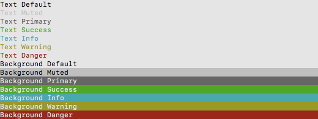

# dein Colorify [ for Win, Mac & Linux ]

**Colorify** was created to simplify and automate tasks related to NET Core console formating. Was born in [HardHat](https://github.com/deinsoftware/hardhat/) project as a Class. Now grew up as library and can be used by other console applications.

Contributions or Beer will be appreciated

> The Code is Dark and Full of Errors!  
> Console is your friend ... don't be afraid!

## Menu

* [Getting Started](#getting-started)
  * [Prerequisites](#prerequisites)
    * [Dependencies](#dependencies)
    * [Add As Package](#add-as-package)
    * [Add As Reference](#add-as-reference)
  * [Instantiate Library](#instantiate-library)
* [Usage](#usage)
  * [Colors](#colors)
  * [Write](#write)
  * [WriteLine](#writeline)
  * [Align](#align)
  * [BlankLines](#blanklines)
  * [DivisionLine](#divisionline)
* [About](#about)
  * [Built With](#built-with)
  * [Contributing](#contributing)
  * [Versioning](#versioning)
  * [Authors](#authors)
  * [License](#license)
  * [Acknowledgments](#acknowledgments)

---

## Getting Started

These instructions will get you a copy of the project up and running on your local machine for development and testing purposes.

### Prerequisites

What things you need to install?

* [NET Core SDK](https://www.microsoft.com/net/download)
* [ToolBox](https://github.com/deinsoftware/toolbox/)

### Installing

**ToolBox** is available as [project](https://github.com/deinsoftware/toolbox/) or [package](https://www.nuget.org/packages/dein.ToolBox). We strong recommend add as a NuGet package if don't need make modifications directly on source code library.

Follow this instructions to add **ToolBox** in your project.

#### Dependencies

* [Newtonsoft.Json](https://www.nuget.org/packages/Newtonsoft.Json) Library
* [dein.ToolBox](https://www.nuget.org/packages/dein.ToolBox) Library

#### Add As Package

In your project folder, where is located .csproj file run this command on terminal:

```terminal
dotnet add package dein.Colorify
dotnet add package dein.ToolBox
dotnet add package Newtonsoft.Json --version 10.0.3
```

Official documentation: [dotnet add package](https://docs.microsoft.com/en-us/dotnet/core/tools/dotnet-add-package)

#### Add As Reference

Clone **ToolBox** from GitHub on *recommended* path. Using this command on terminal:

| OS | Command |
| --- | --- |
| win | `git clone https://github.com/deinsoftware/colorify.git "D:\Developer\DEIN\Projects\_devCC"` |
| mac | `git clone https://github.com/deinsoftware/colorify.git ~/Developer/DEIN/Projects/_devCC` |

In your project folder, where is located .csproj file run this command on terminal:

| OS | Command |
| --- | --- |
| win | `dotnet add reference "D:\Developer\DEIN\Projects\_devCC\Colorify\Colorify.csproj"` |
| mac | `dotnet add reference ~/Developer/DEIN/Projects/_devCC/Colorify/Colorify.csproj` |

Official documentation: [dotnet add reference](https://docs.microsoft.com/en-us/dotnet/core/tools/dotnet-add-reference)

### Instantiate Library

On the main class Program, add an static property Format and inside Main method create an instance of the  library according the Operative System.

```csharp
class Program
{
    public static Format _colorify {get; set;}

    static void Main(string[] args)
    {
        switch (OS.GetCurrent())
        {
            case "win":
            case "gnu":
                _colorify = new Format(Theme.Dark);
                break;
            case "mac":
                _colorify = new Format(Theme.Light);
                break;
        }
        //Foo()
        //Bar()
        _colorify.ResetColor();
    }
}
```

Take note that `_colorify.ResetColor();` command is important in order to reset default terminal colors when programs finish.

If you want to use `_colorify` in other class, add an static using to `Program` class:

```csharp
using static Namesapace.Program;
```
replace Namespace with defined namespace in your project.

## Usage

Keep calm, you are almost done. Review this usage steps and enjoy the life. 

To understand how this library works, take a look inside [Sample](https://github.com/deinsoftware/colorify/tree/master/Sample) folder. Better easy to use guide than words.

Just go to project folder, where is located `Colorify.sln` file run this command on terminal:

```terminal
cd Sample
dotnet run
```

### Colors

**Colorify** colors was created inspired on [Bootstrap colors](https://getbootstrap.com/docs/4.0/utilities/colors/) a list whit a meaning easy to remember.

```csharp
_colorify.WriteLine("Text Default", Colors.txtDefault);
_colorify.WriteLine("Text Muted", Colors.txtMuted);
_colorify.WriteLine("Text Primary", Colors.txtPrimary);
_colorify.WriteLine("Text Success", Colors.txtSuccess);
_colorify.WriteLine("Text Info", Colors.txtInfo);
_colorify.WriteLine("Text Warning", Colors.txtWarning);
_colorify.WriteLine("Text Danger", Colors.txtDanger);
_colorify.WriteLine("Background Default", Colors.bgDefault);
_colorify.WriteLine("Background Muted", Colors.bgMuted);
_colorify.WriteLine("Background Primary", Colors.bgPrimary);
_colorify.WriteLine("Background Success", Colors.bgSuccess);
_colorify.WriteLine("Background Info", Colors.bgInfo);
_colorify.WriteLine("Background Warning", Colors.bgWarning);
_colorify.WriteLine("Background Danger", Colors.bgDanger);
```

**Light (for MacOS):**  


**Dark (for Windows and Linux):**  


Colors are defined on [Theme](https://github.com/deinsoftware/colorify/tree/master/Colorify/Theme) folder. There is two themes Light (for MacOs) and Dark (for Windows and Linux). You can edit the `ThemeLight.cs` or `ThemeDark.cs` files or create a new one implementing the `ITheme` interface.

Take a look on official documentation: [ConsoleColor Enumeration](https://msdn.microsoft.com/en-us/library/system.consolecolor)

### Write

`_colorify.Write` work like `Console.Write` but wrapped with colors. If you don't specify a color will use the `Colors.txtDefault` by default.

```csharp
_colorify.Write("Text");
```

```csharp
_colorify.Write("Text", Colors.bgDefault);
```

You can stack a multiple `_colorify.Write`, just remember define the last one as WriteLine.

```csharp
_colorify.Write(" Default ", Colors.bgDefault);
_colorify.Write(" Muted   ", Colors.bgMuted);
_colorify.Write(" Primary ", Colors.bgPrimary);
_colorify.Write(" Success ", Colors.bgSuccess);
_colorify.Write(" Info    ", Colors.bgInfo);
_colorify.Write(" Warning ", Colors.bgWarning);
_colorify.WriteLine(" Danger  ", Colors.bgDanger);
```


### WriteLine

`_colorify.WriteLine` work like `Console.WriteLine` with a line terminator after the text but wrapped with colors. If you don't specify a color will use the `Colors.txtDefault` by default.

```csharp
_colorify.WriteLine("Text with line terminator");
```

```csharp
_colorify.WriteLine("Text with line terminator", Colors.bgDefault);
```

Automatic line wrap with long text:

```csharp
_colorify.Write("Short Text at First Preceded with a ", Colorify.Colors.bgInfo);
_colorify.WriteLine(" Long Multi line text with Line Wrap that bring a new line", Colorify.Colors.bgSuccess);
```


### Align

All the align methods (Center/Left/Right) works like `Console.WriteLine` but with align operation and wrapped with colors. If you don't specify a color will use the `Colors.txtDefault` by default.

```csharp
_colorify.AlignCenter("Text Aligned to Center");
_colorify.AlignRight("Text Aligned to Right");
_colorify.AlignLeft("Text Aligned to Left");
```

```csharp
_colorify.AlignCenter("Text Aligned to Center", Colors.bgInfo);
_colorify.AlignRight("Text Aligned to Right", Colors.txtDefault);
_colorify.AlignLeft("Text Aligned to Left", Colors.txtDanger);
```

`AlignSplit` is the way to show two values on the same line. Text will be split with pipe `|` character, the first element will be aligned to left and second aligned to right.

```csharp
_colorify.AlignSplit("<-Text to Left| Text to Right->");
```

```csharp
_colorify.AlignSplit("<-Text to Left| Text to Right->", Colors.bgSuccess);
```


### BlankLines

`_colorify.BlankLines` works like `Console.WriteLine` but without text. You can combine the amount of lines and color. Default values will be `1` line and `Colors.txtDefault`.

```csharp
_colorify.BlankLines();
_colorify.BlankLines(Colorify.Colors.bgDanger);
```


```csharp
_colorify.BlankLines(3);
_colorify.BlankLines(3, Colors.bgSuccess);
```


### DivisionLine

`_colorify.DivisionLine` works like `Console.WriteLine` but without the same character as full width text. . If you don't specify a color will use the `Colors.txtDefault` by default.

```csharp
_colorify.DivisionLine('-', Colors.bgDefault);
_colorify.DivisionLine('+', Colors.bgMuted);
_colorify.DivisionLine('~', Colors.bgPrimary);
_colorify.DivisionLine('=', Colors.bgSuccess);
_colorify.DivisionLine('-', Colors.bgInfo);
_colorify.DivisionLine('*', Colors.bgWarning);
_colorify.DivisionLine('.', Colors.bgDanger);
```


⇧ [Back to menu](#menu)

---

## About

### Built With

* [VS Code](https://code.visualstudio.com/) - Code editing redefined.
* [SonarQube](https://sonarcloud.io/dashboard/index/dein:colorify) - Continuous code quality.

### Contributing

Please read [CONTRIBUTING](CONTRIBUTING.md) for details on our code of conduct, and the process for submitting pull requests to us.

### Versioning

We use [SemVer](http://semver.org/) for versioning. For the versions available, see the [Colorify](https://github.com/deinsoftware/colorify/tags) on GitHub.

### Authors

* **Camilo Martinez** [[Equiman](http://stackoverflow.com/story/equiman)]

See also the list of [contributors](https://github.com/deinsoftware/colorify/contributors) who participated in this project.

### License

This project is licensed under the GNU GPLv3 License - see the [LICENSE](LICENSE) file for details.

### Acknowledgments

* [StackOverflow](http://stackoverflow.com): The largest online community for programmers.
* [Dot Net Perls](https://www.dotnetperls.com/console-color): C# Console Color, Text and BackgroundColor.

⇧ [Back to menu](#menu)
